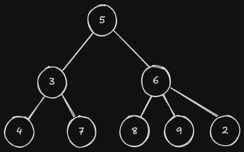
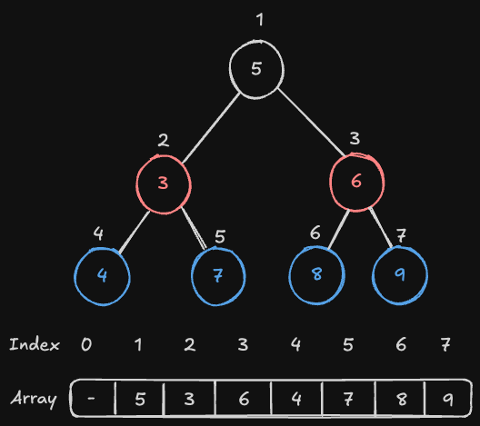

# 정렬
## 힙 정렬

기존에 배웠던 선택 정렬을 거꾸로 진행한다면, 처음에는 가장 큰 숫자를 골라 맨 오른쪽 원소와 교환한 뒤, 그 다음으로 큰 숫자를 골라 오른쪽에서 두 번째 원소와 교환하는 것을 반복하여 가장 작은 원소를 선택하게 되는 것으로 정렬을 진행해볼 수 있다. 

위 방법에서 시간복잡도가 O(N^2)이 나오는 이유는 최댓값을 찾기 위해 N개의 원소를 전부 순회하는데 걸리는 시간이 O(N)이기 때문이다. 

만약 주어진 원소들 중 최댓값을 찾는 것이 O(N)이 아니 O(logN)일 수 있다면, N개의 원소를 정렬하는데 걸리는 시간이 O(NlogN)이 된다.

## heap과 이진 트리
heap이라는 자료구조를 이용하면, N개의 원소들 중 최댓값을 찾는 것을 O(logN)만에 할 수 있다.

heap은 이진 트리 형태를 띄고 있다. 트리라는 것은 다음과 같이 맨 위에는 큰 하나의 기둥이 있고, 아래로 내려갈수록 가지가 계속 뻗어나오는 구조를 띄고 있는 자료구조이다.



트리는 두 지점의 연결 관계로 구성되어 있는데, 계층관계가 존재한다는 것이 특징이다. 연결관계에서 위쪽에 있는 점을 부모라고 부르며, 아래쪽에 있는 점을 자식이라고 부른다.

아래는 추가적인 용어와 의미이다.
```
-노드: 각 지점을 의미
-루트 노드: 트리에서 맨 꼭데기를 의미
-부모, 자식: 트리에서 연결된 두 노드의 관계를 의미하는데, 더 위쪽에 있는 노드를 부모 노드, 아래쪽에 있는 노드를 자식 노드
-차수: 특정 노드를 기준으로, 자식의 수가 얼마나 되는지 의미
-깊이: 루트 노드와 얼마나 떨어져 있는지를 가리키는 말
-높이: 트리에서 깊이가 가장 깊은 노드의 깊이를 의미
-리프 노드: 자식을 갖고 있지 않은 노드를 의미
```

이진 트리는, 모든 노드에 자식이 최대 2개씩만 있는 구조이다.
그리고 이진 트리인 경우에는, 배열로 깔끔하게 구현이 가능하다는 특징이 있다.



이렇게 넣게 되면, 특정 노드의 위치가 i라고 한다면, 자연스럽게 왼족 자식의 위치는 i*2, 오른쪽 자식의 위치는 i*2+1이 된다. 즉 이진트리는 배열로 구현이 가능하며 특정 노드 i의 자식 노드를 조회하기 위해서는 i*2, i*2+1을 하면 된다.

모든 노드에 대해 부모 노드가 자신의 자식 노드가 갖는 값보다 같거나 큰 경우를 만족한다면 이를 max-heap이라 한다. Max Heap의 가장 중요한 특징 중 하나는, 루트 노드에는 전체 숫자 중 최댓값이 항상 들어있다는 것이다.

max-heap으로 만드는 과정은 다음과 같다.
n / 2번째 원소부터 거꾸로 1번째 원소까지 순서대로 보면서 heapify라는 과정을 거친다. heapify라는 것은, 현재 노드를 기준으로 이 노드가 heap 특성에 맞을 때까지 계속 밑으로 내려주는 과정을 말한다.

heapify는 다음 조건에 맞춰 진행됩니다.

- 현재 노드 위치를 i라고 한다면, 현재 노드, 왼쪽 자식(i * 2번째) 노드, 그리고 오른쪽 자식(i * 2 + 1번째) 노드 중 가장 큰 노드가 무엇인지 판단한다. 이 세 노드 중 가장 큰 노드를 편의상 largest 노드라고 부른다.
- 만약 largest 노드가 현재 노드 i가 아닌 자식 노드라면, 현재 노드(i)와 해당 자식 노드(largest)의 값을 교환한다. 교환 이후에는 다시 largest 위치에서 heapify를 진행한다. 
- 이렇듯 현재 노드가 heap 조건을 만족하도록 계속 내려주는 것을 재귀적으로 반복해준다.
- 만약 largest 노드가 현재 노드 i라면, 종료합니다.
아래 그림에서 n은 7이므로, 3번째 원소부터 heapify 과정을 거친다.

heap은 이진 트리 중에서도 왼쪽으로 가득 채워져있는 완전 이진 트리 모양으로 되어있기 때문에 트리의 높이가 logN이 된다. 따라서 heapify과정은 한번 일어날때 최대 logN번 일어나게 된다.

처음 max-heap을 만드는데 총 n / 2개의 원소에 대해 heapify과정을 거치게 되며 엄밀하게 계산했을 때 시간은 O(N)이 소요되지만, max-heap을 구성한 이후에는 계속 최댓값을 마지막 원소인 n번째 원소와 교환하며 다시 heapify를 진행하는 것을 n번 반복하고 이 과정은 각각 최대 O(logN)의 시간이 소요되기에 총 시간복잡도는 O(NlogN)이 된다.

따라서 heap sort의 경우 시간복잡도는 O(NlogN)이다.