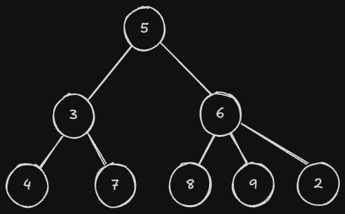

# 트리
## 트리의 개념, 용어

위와 같은 구조를 트리라고 한다. 

트리는 두 지점의 연결관계로 구성되어 있는데, 계층관계가 존재한다는 것이 특징이다. 우리는 하나의 연결 관계에서 위쪽에 있는 점을 부모라고 부르며, 아래쪽에 있는 점을 자식이라고 부른다.

아래는 트리와 관련된 용어이다.
- 노드: 각 지점을 의미한다. 정점이라고 부르기도 한다.
- 간선: 두 노드를 연결하는 선을 의미한다. 에지라고 부르기도 한다.
- 루트 노드: 트리에서 멘 꼭데기를 의미한다.
- 부모, 자식: 트리에서 연결된 두 노드의 관계를 의미하는데, 더 위쪽에 있는 노드를 부모 노드, 아래족에 있는 노드를 자식 노드라고 부른다.
- 차수: 특정 노드를 기준으로, 자식의 수가 얼마나 되는지 의미한다.
- 깊이: 루트 노드와 얼마나 떨어져 있는지 가리키는 말이다.
- 높이: 트리에서 깊이가 가장 깊은 노드의 깊이 혹은 1을 더한 값을 의미한다.
- 리프 노드: 자식을 갖고 있지 않은 노드를 의미한다.

부모 자식 관계가 정의되지 않는 경우에도 트리라고 부릅다. 즉, 트리의 원래 정의는 노드끼리 전부 연결되어 있으면서 사이클이 존재하지 않는 그래프이다. 이런 경우를 **Unrooted tree**라고 부른다. 반대로 루트 노드가 설정되어 있는 트리는 **Rooted tree**라고 부른다. 참고로 Unrooted tree에서의 차수는 노드에 연결된 간선의 개수이고, 리프 노드의 정의는 차수가 1인 노드가 된다.

Unrooted tree에서의 루트 노드는 정하기 나름이다. 트리의 루트 노드가 정해지면 그때부터 부모, 자식, 차수 등이 정의가 되는 것이다.
