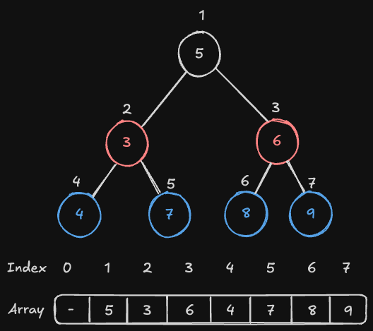

# 트리
## 이진 트리
트리에서 자식의 수를 최대 2개로 제한하게 되면 이 트리를 이진 트리라고 한다. 물론 자식의 수가 1개 또는 0개가 될 수 있다.

## 이진 트리의 특성
이진트리는 구현이 쉽다는 특성이 있다. 배열로도 구현이 가능하다.

이진 트리의 자식은 두개이기 때문에, 하나는 왼쪽에, 그리고 다른 하나는 오른쪽에 존재한다. 

배열의 0번 값을 비우고 , 루트 노드를 1번에 넣어주고 왼쪽 자식을 2번에, 오른쪽 자식을 3번에 넣는다. 그 후 왼쪽 자식과 오른쪽 자식을 알맞게 넣어주면 된다.

이렇게 넣게 되면, 특정 노드의 위치가 i라고 한다면, 자연스럽게 왼쪽 자식의 위치는 i*2, 오른쪽 자식의 위치는 i*2 + 1이 되는 걸 볼 수 있다. 즉, 이진 트리는 배열로 구현이 가능하며 특정 노드 i의 자식 노드를 조회하기 위해서는 i * 2, i * 2 + 1을 하면 된다. 반대로 부모 노드의 위치는 i/2로 결정된다는 것을 알 수 있다.

"""
자식이 1개인 경우 즉 꽉 차있지 않은 경우에는 순서대로 넣을 수 없으니 비어있는 자식은 배열에도 칸을 비워둬야 한다.
이 경우에도 마찬가지로 왼쪽 자식은 i*2, 오른쪽 자식은 i*2+1이 된다.
"""
